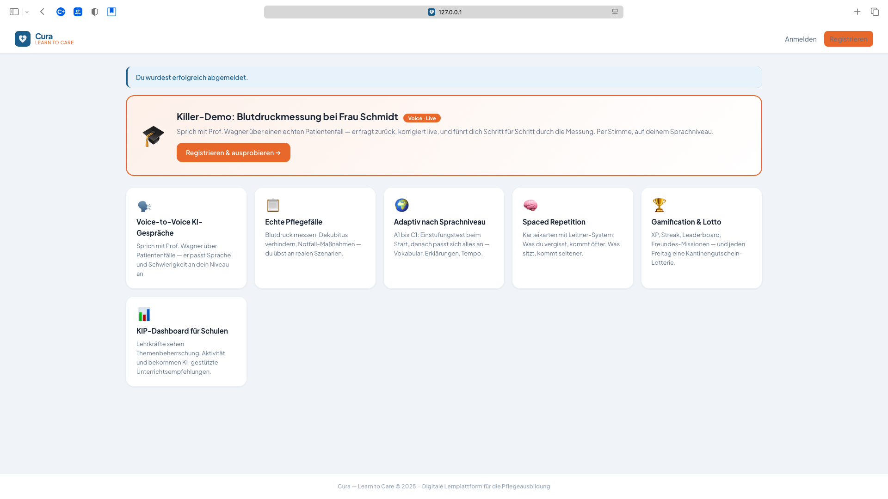
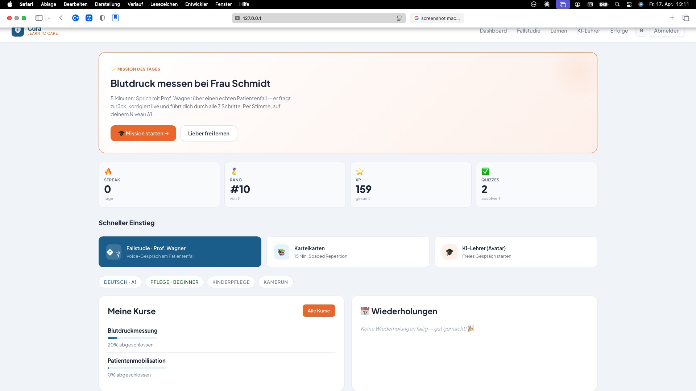
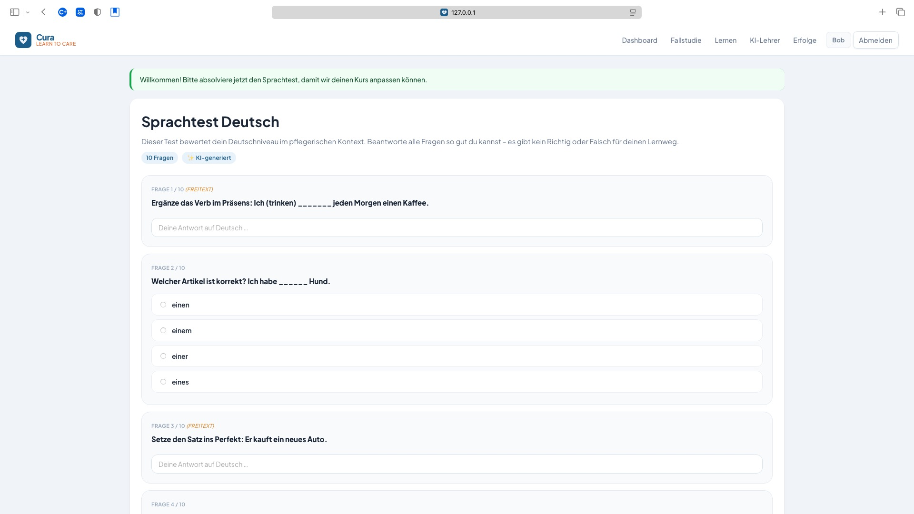
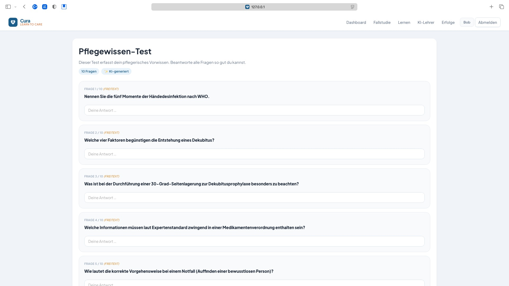

# Cura - AI Learning Support Frontend

Cura is an AI-supported learning platform for students in nursing education. This repository contains the frontend application: a Flask-based web experience for onboarding, course learning, quizzes, spaced repetition, and voice-first sessions with an avatar-based AI professor.

The platform is designed to make learning more personal and more accessible. Students can start with adaptive onboarding, learn through course modules, ask questions about uploaded course material, and interact with a spoken AI professor that explains topics step by step.

The backend services for retrieval, generation, and document processing live in the companion repository: [ai_learning_support_backend](https://github.com/TheCez/ai_learning_support_backend).

## What the frontend includes

- Student and teacher authentication flows
- Adaptive onboarding with AI-generated language assessment and nursing knowledge baseline tests
- Student dashboard with progress, reviews, quizzes, and quick access to learning activities
- Course and module views for structured learning
- AI Professor Q&A grounded in uploaded course material
- KI-Lehrer avatar experience with speech-to-text, text-to-speech, and synchronized slide-based explanations
- Quiz generation and spaced repetition review loops
- Teacher upload flow for course PDFs with readiness polling after indexing

## Architecture

The frontend is a Flask application with server-rendered templates and client-side JavaScript for interactive experiences.

- `app.py`: main Flask app, routes, and API proxy logic
- `models.py`: SQLAlchemy data models for users, courses, quizzes, enrollments, and repetition tracking
- `services.py`: application business logic and AI integration helpers
- `templates/`: Jinja templates for onboarding, dashboards, courses, quizzes, and KI-Lehrer views
- `static/`: CSS, JavaScript, and other frontend assets

The app talks to two backend services over HTTP:

- `rag_api` on port `8000` for PDF upload, indexing, and retrieval
- `llm_api` on port `8001` for answer generation, quizzes, presentations, flashcards, and library content

## AI flow

The current project uses a hybrid AI setup:

- Core learning features call the backend `llm_api`
- PDF ingestion and document readiness are handled by `rag_api`
- KI-Lehrer uses an avatar-driven presentation flow with per-slide narration
- Text-to-speech runs through ElevenLabs first, with `edge-tts` fallback
- Speech-to-text uses OpenAI Whisper with fallback support where available
- The onboarding language test still uses Gemini locally as a temporary MVP exception

## Demo

The screenshots below show the current product flow. A short walkthrough video is also included in this repository.

Demo video: [Watch the Cura demo](docs/demo/cura-demo.mp4)

| Landing page and feature overview | Student dashboard |
| --- | --- |
|  |  |

| Adaptive language onboarding | Nursing knowledge baseline test |
| --- | --- |
|  |  |

## Running locally

### Prerequisites

- Python 3.11+
- Access to the backend services from the companion repository
- API keys for the speech and AI providers you want to use

### Installation

```bash
python -m venv venv
venv\Scripts\activate
pip install -r requirements.txt
```

### Environment

Create a `.env` file based on `.env.example`.

Example values:

```env
RAG_API_BASE_URL=http://host.docker.internal:8000/api/v1
LLM_API_BASE_URL=http://host.docker.internal:8001
ELEVENLABS_API_KEY=your_elevenlabs_key
OPENAI_API_KEY=your_openai_key
GEMINI_API_KEY=your_gemini_key
```

If you run the frontend in Docker and the backend on the host machine, the included Docker setup uses `host.docker.internal` so the container can reach the backend services.

### Start the app

```bash
python app.py
```

The frontend will be available at [http://127.0.0.1:5000](http://127.0.0.1:5000).

## Backend integration

This frontend depends on the backend monorepo for AI and retrieval features:

- Backend repository: [https://github.com/TheCez/ai_learning_support_backend](https://github.com/TheCez/ai_learning_support_backend)
- `rag_api`: document upload, indexing, retrieval, and image serving
- `llm_api`: grounded answers, quiz generation, presentations, flashcards, and library outputs

Important integration rules:

- Do not call Gemini directly for core learning flows from the frontend
- Poll document readiness after every PDF upload before enabling AI features
- Render backend image URLs as returned by the API
- Use the KI-Lehrer presentation response shape based on `slides[]`, including `spoken_text` and optional `source_page`

## Tech stack

- Flask
- SQLAlchemy
- Jinja2 templates
- Vanilla JavaScript
- ElevenLabs
- OpenAI Whisper
- `edge-tts`
- Google Gemini for temporary onboarding generation

## Project status

This repository reflects the latest MVP state of Cura:

- AI Professor, KI-Lehrer, and quiz generation are wired to external backend services
- Voice and avatar flows are integrated in the frontend
- Upload and indexing flows are available for teachers
- Dashboard and repetition experiences are implemented
- Flashcards, leaderboards, and a fuller analytics layer are still opportunities for expansion
